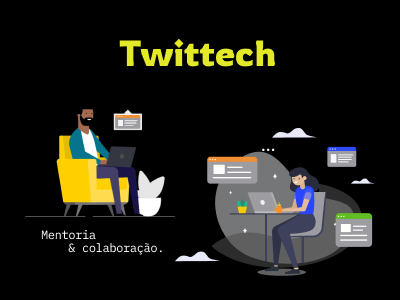

 
<h1 align="center">
  
</h1>
 
 

  <a href="#memo-sobre">Sobre</a>&nbsp;&nbsp;&nbsp;|&nbsp;&nbsp;&nbsp;
  <a href="#floppy_disk-tecnologias">Tecnologias</a>&nbsp;&nbsp;&nbsp;|&nbsp;&nbsp;&nbsp;
  <a href="#computer-projeto">Projeto</a>&nbsp;&nbsp;&nbsp;|&nbsp;&nbsp;&nbsp;
  <a href="#purple_heart-desenvolvimento">Desenvolvimento</a>

 
 

## :memo: Sobre
 
<h3 align="center">Aplicação PWA responsiva, que proporciona ao usuário o acesso a profissionais experientes e com expertise em determinadas áreas de tecnologia, para facilitar a troca de conhecimento e ajuda para resolução de problemas.</h3>
 

<h4 align="center">🌎  Nosso foco é estimular a colaboração e mentoria </h4>
 
 

## :floppy_disk: Tecnologias
 
<h4>Este projeto está sendo desenvolvido com as seguintes tecnologias:</h4>
 
<h4>Front-end</h4>
<ul>
  <li><a href="https://developer.mozilla.org/pt-BR/docs/Aprender/JavaScript" target="_blank">JavaScript</a></li>
  <li><a href="https://reactjs.org/" target="_blank">ReactJs</a></li>
  <li><a href="https://pt-br.reactjs.org/docs/hooks-intro.html" target="_blank">React Hooks</a></li>
  <li><a href="https://pt-br.reactjs.org/docs/react-dom.html" target="_blank">React DOM</a></li>
  <li><a href="https://github.com/facebook/create-react-app/tree/master/packages/react-scripts" target="_blank">React Scripts</a></li>
  <li><a href="https://styled-components.com/" target="_blank">Styled Components</a></li>
  <li><a href="https://www.npmjs.com/package/styled-normalize" target="_blank">Styled Normalize</a></li>
</ul>
 
<h4>Back-end</h4>
<li><a href="https://developer.mozilla.org/pt-BR/docs/Aprender/JavaScript" target="_blank">JavaScript</a></li>
  <li><a href="https://nodejs.org/en/" target="_blank">NodeJS</a></li>
  <li><a href="https://expressjs.com/pt-br/" target="_blank">Express</a></li>
  <li><a href="https://www.mongodb.com/1" target="_blank">Mongo</a></li>
  <li><a href="https://mongoosejs.com/docs/models.html" target="_blank">Mongoose</a></li>
  <li><a href="https://jwt.io/" target="_blank">JWT</a></li>
  <li><a href="https://pt.wikipedia.org/wiki/MVC" target="_blank">MVC</a></li>
  <li><a href="https://www.docker.com/" target="_blank">Docker</a></li>
 
 
 
 

## :computer: Projeto
 
 

<a  href="https://www.figma.com/file/SjyijWyCQVv1L0QiByADc8/Twittech?node-id=0%3A1" target="_blank">🎨  Clicando aqui </a> é possível verificar o layout do projeto, desenvolvido no Figma

 
 
 

## :purple_heart: Desenvolvimento
 
 

<table>
  <tr>
    <td align="center" style="border: none;">
      <a href="https://github.com/alinecbsr">
        
         
        
          <b>Aline Rosa</b>
        
      </a>
       
      
<scan title="Code">💻</scan>|<scan title="Documentation">🎨</scan>|<scan title="Bugs">🐛</scan>

    </td>
        <td align="center" style="border: none;">
      <a href="https://github.com/leandrospigolon">
        
         
        
          <b>Leandro Spigolon</b>
        
      </a>
       
      
<scan title="Code">💻</scan>

    </td>
    <td align="center" style="border: none;">
      <a href="https://github.com/maxwelljames91">
        
         
        
          <b>Maxwell James</b>
        
      </a>
       
      
<scan title="Code">💻</scan>

    </td>
    <td align="center" style="border: none;">
      <a href="https://github.com/Ramonuriel13">
        
         
        
          <b>Ramon Uriel</b>
        
      </a>
       
      
<scan title="Code">💻</scan>

    </td>
  </tr>
</table>